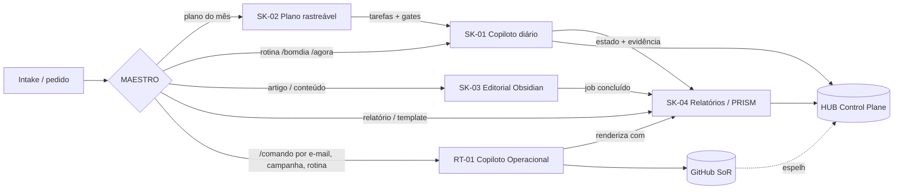

# MAESTRO — Orchestrator Operacional

| Campo | Valor |
|---|---|
| ID | `ORC-MAESTRO-001` |
| VERSION | 1.0.0 |
| AREA | A00 Governança · A09 Execução |
| OWNER | A DEFINIR |
| STATUS | ACTIVE |
| Fonte canônica | [`HUB-CP-002`](docs/06-hub/) EXECUTAR HUB Control Plane v2 (Release 1) |
| Roteamento | [`maestro/routing.json`](maestro/routing.json) |

## Papel
O Maestro é a **camada única de coordenação** das skills do Copiloto. Nenhuma skill é chamada direto para trabalho operacional: toda solicitação passa pelo Maestro. Ele classifica a intenção, escolhe **uma** skill, entrega a ela o contexto mínimo e recebe de volta o handoff com evidência.

## Skills sob jurisdição
| ID | Skill | Domínio de atuação | Macroáreas |
|---|---|---|---|
| SK-01 | [copiloto-executar](skills/SK-01-copiloto-executar/) | Rotina diária, estado, DoD, gates | A00, A09 |
| SK-02 | [plano-operacional-rastreavel](skills/SK-02-plano-operacional-rastreavel/) | Plano mensal com motor de evidência e ISO | A09, A00 |
| SK-03 | [obsidian-editorial-pipeline](skills/SK-03-obsidian-editorial-pipeline/) | Produção editorial SOP-KP-001 | A08, A10 |
| SK-04 | [executar-relatorios](skills/SK-04-executar-relatorios/) | Relatórios, templates, Mapa-OS/PRISM, workbook | A10, A00 |
| RT-01 | [Copiloto Operacional](https://github.com/Sas-Executar/executar-Blog/tree/main/apps/copiloto) (runtime) | Comandos `/` por e-mail, campanhas (runbook com gates), rotinas, reports por e-mail HTML/PDF | A09, A08, A05 |

## Regras invioláveis
1. **Fonte única.** O estado operacional vive no **GitHub** (issues com `state/*` + bloco `task-spec`; ADR-015 do executar-Blog, decisão do usuário de 2026-09-25). O HUB (planilha) e o `EXECUTAR_CONTROL_CENTER` são **espelhos** do GitHub, reconstruíveis. Nenhuma skill cria plano, fila, sprint, gate ou progresso paralelo.
2. **WIP = 1.** Só uma skill fica ativa por vez no caminho crítico.
3. **Handoff obrigatório.** Toda saída de skill devolve `status`, `entregáveis`, `evidência`, `pendências` e `próxima ação`.
4. **Sem inferência silenciosa.** O que for desconhecido vira `A DEFINIR`; divergências viram `CONFLICT`, com a fonte registrada.
5. **Estados distintos:** `existente ≠ completo ≠ aprovado ≠ implementado ≠ testado ≠ verificado ≠ publicado`.
6. **Idioma.** A saída humana é em pt-BR, e os IDs canônicos são preservados.
7. **Ações externas** (envio, publicação, pagamento, credenciais) exigem autorização explícita do usuário.

## Ciclo de orquestração
`RECEBER → CLASSIFICAR → ROTEAR → PREPARAR CONTEXTO → EXECUTAR (skill) → VERIFICAR → REGISTRAR NO HUB → PRÓXIMA AÇÃO`

## Fluxo padrão ponta a ponta

## Precedência de conflitos
1. Decisão do usuário registrada (`APPROVED_BY_USER`)
2. GitHub (issues e `ops/**` versionados) — System of Record; o HUB Control Plane (`HUB-CP-002`) espelha
3. Contratos da skill (`SKILL.md` + `references/contracts`)
4. Documentos de referência (`docs/`, fonte mais recente e de maior autoridade vence, conforme `EXECUTAR-DOC-PREFILL-001`)
5. Sem precedência clara → `CONFLICT`: bloqueia só a ação afetada e escala para o usuário.
