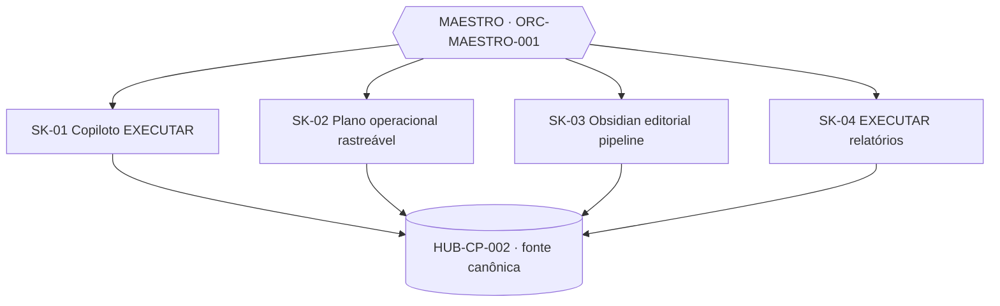

# Copiloto EXECUTAR

Repositório das **skills operacionais do EXECUTAR**, todas coordenadas por um orquestrador único, o **[MAESTRO](MAESTRO.md)** (`ORC-MAESTRO-001`), e ancoradas na fonte canônica **EXECUTAR HUB Control Plane v2** (`HUB-CP-002`).

```
PROGRAMA → MACROÁREAS → DOMÍNIOS ↕ PORTFÓLIO → ARTEFATOS → CAMPOS → DEPENDÊNCIAS → GATES → DOCUMENTOS FINAIS
```

## Sumário
1. [Orquestrador MAESTRO](#1-orquestrador-maestro)
2. [Skills](#2-skills)
3. [Índice da planilha HUB](#3-índice-da-planilha-hub-hub-cp-002)
4. [Documentos](#4-documentos)
5. [Estrutura do repositório](#5-estrutura-do-repositório)

---

## 1. Orquestrador MAESTRO
Toda solicitação entra pelo MAESTRO, que classifica a intenção, roteia para **uma** skill (WIP = 1), exige handoff com evidência e registra o resultado no HUB. Contrato: [`MAESTRO.md`](MAESTRO.md) · rotas: [`maestro/routing.json`](maestro/routing.json).



## 2. Skills

| ID | Skill | Objetivo | Principais funções | Gatilhos | Macroáreas | README |
|---|---|---|---|---|---|---|
| SK-01 | `copiloto-executar` | Operar a rotina diária sobre fonte única, sem estado paralelo | `/bomdia`, `/agora`, `/estado`, `/fechardia`, `/replanejamento`; DoD, evidência, gates | rotina, estado, bloqueio | A00, A09 | [abrir](skills/SK-01-copiloto-executar/README.md) |
| SK-02 | `plano-operacional-rastreavel` | Plano mensal com motor de evidência (FACT/DECISION/ASSUMPTION/GAP/CONFLICT) e limite ISO | Intake, classificação, 7 fases, pacote de 4 entregáveis, juiz validador | plano mensal, formulário mensal | A09, A00 | [abrir](skills/SK-02-plano-operacional-rastreavel/README.md) |
| SK-03 | `obsidian-editorial-pipeline` v2.3 | Ciclo editorial rastreável no Obsidian pela SOP-KP-001 | 8 blocos / 23 etapas, state engine, próxima ação, ZIP de produção | artigo, ciclo editorial | A08, A10 | [abrir](skills/SK-03-obsidian-editorial-pipeline/README.md) |
| SK-04 | `executar-relatorios` | Documentos source-grounded prontos para impressão | Status report, relatório executivo A4, ~60 templates, Mapa-OS/PRISM, workbook Desk&Go | relatório, memo, RACI, Prisma | A10, A00 | [abrir](skills/SK-04-executar-relatorios/README.md) |

**Fluxo padrão:** intake → **SK-02** (plano) → **SK-01** (execução diária) → **SK-03** (produção editorial, quando houver) → **SK-04** (relatório/PRISM) → HUB.

## 3. Índice da planilha HUB (`HUB-CP-002`)
Arquivo: [`docs/06-hub/HUB-CP-002-executar-hub-control-plane-v2.xlsx`](docs/06-hub/HUB-CP-002-executar-hub-control-plane-v2.xlsx) · `schema_version 1.0.0` · ADR-EXECUTAR-HUB-001 · análise de 25/09/2026.

### 3.1 Indicadores
| Indicador | Qtde | Estado |
|---|---|---|
| Abas | 37 | 1 leia-me + 13 formulários + 8 visões + 15 registros |
| Macroáreas | 13 | A00–A12 |
| Domínios | 24 | D0 + D01–D23, todos ACTIVE |
| Itens de portfólio | 20 | 1 PROGRAM_OPS + 19 PRODUCT_INITIATIVE; owner A DEFINIR |
| Templates | 20 | 1 por tipo de artefato |
| Artefatos | 37 | 23 MACRO + 14 SPECIALIZED |
| Campos | 1.125 | 0 respostas humanas |
| Dependências | 0 | GAP-DEP-01 |
| Gates | 12 | G00–G11, todos PENDING |
| Documentos finais | 34 | 13 de macroárea + 20 de portfólio + 1 do programa, todos NOT_CREATED |
| Decisões | 25 | 23 PROPOSED, 2 APPROVED_BY_USER |
| Gaps | 10 | 5 NEXT_ACTION, 4 USER_ACTION_REQUIRED, 1 STRUCTURAL; todos OPEN |
| Conflitos | 10 | Todos ABERTO |
| Fontes | 5 | SRC-01 a SRC-05 |

**Origem epistêmica dos 1.125 campos:** PROPOSED 1.013 (90,0%) · EXTERNAL_EVIDENCE 68 (6,0%) · DIRECT 40 (3,6%) · CONFLICT 4 (0,4%).

### 3.2 Mapa das abas
| Camada | Abas | Uso |
|---|---|---|
| Leia-me | `00_Leia-me` | Regras, convenção de cor, hierarquia |
| Entrada humana | `01_Formulario_A00` … `A12` | Única superfície editável (coluna **Resposta**) |
| Visões (derivadas) | `02_Visao_Programa`, `03_Visao_Macroareas`, `04_Visao_Portfolio`, `05_Visao_Artefatos`, `06_Visao_Dependencias`, `07_Visao_Gates`, `08_Visao_Documentos_Finais`, `09_Indice_IDs` | Somente leitura |
| Registros (estrutura) | `10_REG_Macroareas`, `11_REG_Dominios`, `12_REG_Portfolio`, `13_REG_Templates`, `14_REG_Artefatos`, `15_REG_Campos`, `16_REG_Dependencias`, `17_REG_Gates`, `18_REG_Evidencias`, `19_REG_Documentos`, `20_REG_Decisoes`, `21_REG_Gaps`, `22_REG_Conflitos`, `23_REG_Legacy_ID_Map`, `24_REG_Sources` | Fonte estrutural normalizada |

### 3.3 Macroáreas × domínios × artefatos × campos
| ID | Macroárea | Domínios | Artefatos | Campos | Skill |
|---|---|---|---|---|---|
| A00 | Governança, Estratégia e Gestão | D0, D01, D02, D03, D18 | 10 | 307 | SK-01, SK-02, SK-04 |
| A01 | Negócio e Go-to-Market | D13, D14, D15 | 4 | 130 | — |
| A02 | Produto e Experiência | D10, D11 | 4 | 113 | — |
| A03 | Handoff Produto → Engenharia | — | 0 | 0 | — |
| A04 | Arquitetura, Engenharia e Implementação | D12 | 1 | 48 | — |
| A05 | Operações, Plataforma, Deploy e Segurança | D08 | 2 | 43 | — |
| A06 | Dados, Pesquisa e Conhecimento | D05, D06, D09 | 6 | 142 | — |
| A07 | Corporativo e Suporte | D04 | 1 | 39 | — |
| A08 | Conteúdo, Comunicação e Growth | D16 | 1 | 36 | SK-03 |
| A09 | Execução e Planejamento do Trabalho | D07 | 2 | 59 | SK-01, SK-02 |
| A10 | Documentação e Governança do Conhecimento | D21, D22, D23 | 3 | 93 | SK-03, SK-04 |
| A11 | Ferramentas, IA e Ativos Reutilizáveis | D19, D20 | 2 | 76 | — |
| A12 | Stakeholders e Ecossistema | D17 | 1 | 39 | — |
| | **Total** | **24** | **37** | **1.125** | |

### 3.4 Gates
G00 INITIATIVE_READY · G01 BUSINESS_READY · G02 PRODUCT_READY · G03 DEVELOPMENT_READY · G04 ENGINEERING_READY · G05 RELEASE_READY · G06 GO_LIVE · G07 OPERATIONAL_READY · G08 GTM_READY · G09 MEASURED · G10 LEARNING_CAPTURED · G11 DOCUMENTED

### 3.5 Pontos de atenção
- **A03 vazia:** a macroárea não tem nenhum domínio, artefato ou campo.
- **Nenhuma dependência registrada** (GAP-DEP-01), então os gates não avançam.
- **Divergência de evidência:** 44 campos `found_direct` (REG_Evidencias) contra 40 `FOUND` (REG_Campos).
- **Conflitos-chave:** CFL-01 (37 contra 46 documentos) e CFL-02 (janela GTM de 07/09/2026 expirada sem verificação).
- **Owners:** todos A DEFINIR.

## 4. Documentos
Catálogo completo: [`docs/README.md`](docs/README.md).

| ID | Classe | Documento |
|---|---|---|
| DOC-GOV-001 | Governança | [Business Docs: arquitetura D01–D23](docs/01-governanca/DOC-GOV-001-business-docs-arquitetura-d01-d23.md) |
| DOC-PRM-001 | Prompt | [Prompt mestre: pré-preenchimento documental](docs/02-prompts/DOC-PRM-001-prompt-mestre-pre-preenchimento.md) |
| DOC-PRM-002 | Prompt | [Prompt do workbook integrado](docs/02-prompts/DOC-PRM-002-prompt-workbook-integrado.md) |
| DOC-FRM-001 | Formulário | [Formulário mestre D01–D23](docs/03-formularios/DOC-FRM-001-formulario-mestre-d01-d23.md) |
| DOC-SCH-001 | Schema | [Schema YAML do SaaS Entrypoint](docs/04-schemas/DOC-SCH-001-schema-yaml-saas-entrypoint.md) |
| DOC-PRD-001 | Produto | [Checklist de product management](docs/05-produto/DOC-PRD-001-checklist-product-management.md) |
| HUB-CP-002 | Hub | [EXECUTAR HUB Control Plane v2](docs/06-hub/HUB-CP-002-executar-hub-control-plane-v2.xlsx) |
| HUB-MAP-001 | Hub | [Mapa operacional: payload PRISM](docs/06-hub/HUB-MAP-001-mapa-operacional-prisma-payload.json) |

## 5. Estrutura do repositório
```
README.md             índice mestre (este arquivo)
MAESTRO.md            contrato do orquestrador
maestro/routing.json  rotas intenção → skill
skills/SK-0X-*/       skills (SKILL.md = ponto de entrada; README.md = resumo)
docs/0X-*/            documentos classificados por ID
```
